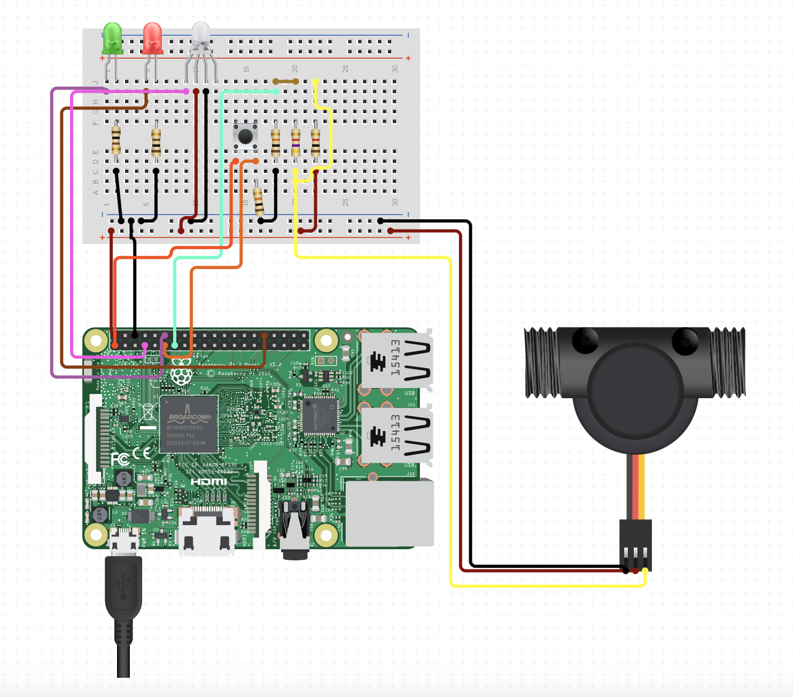
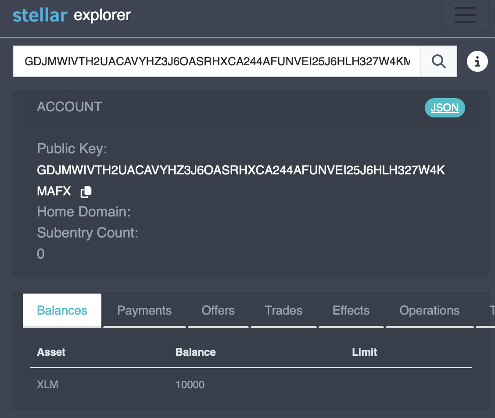
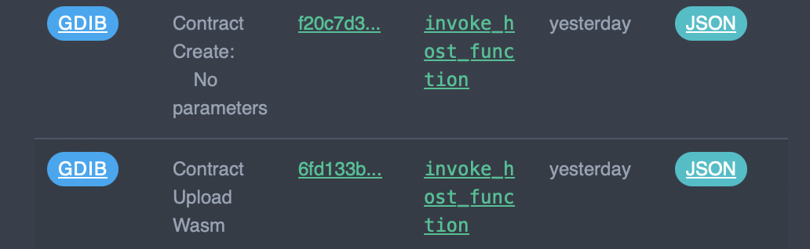
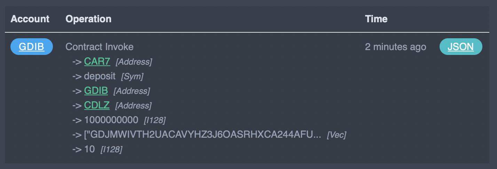
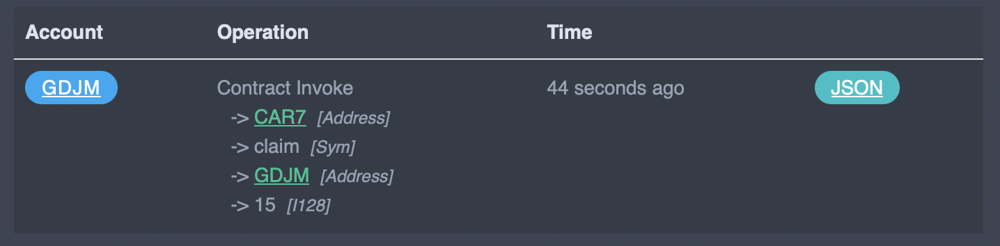
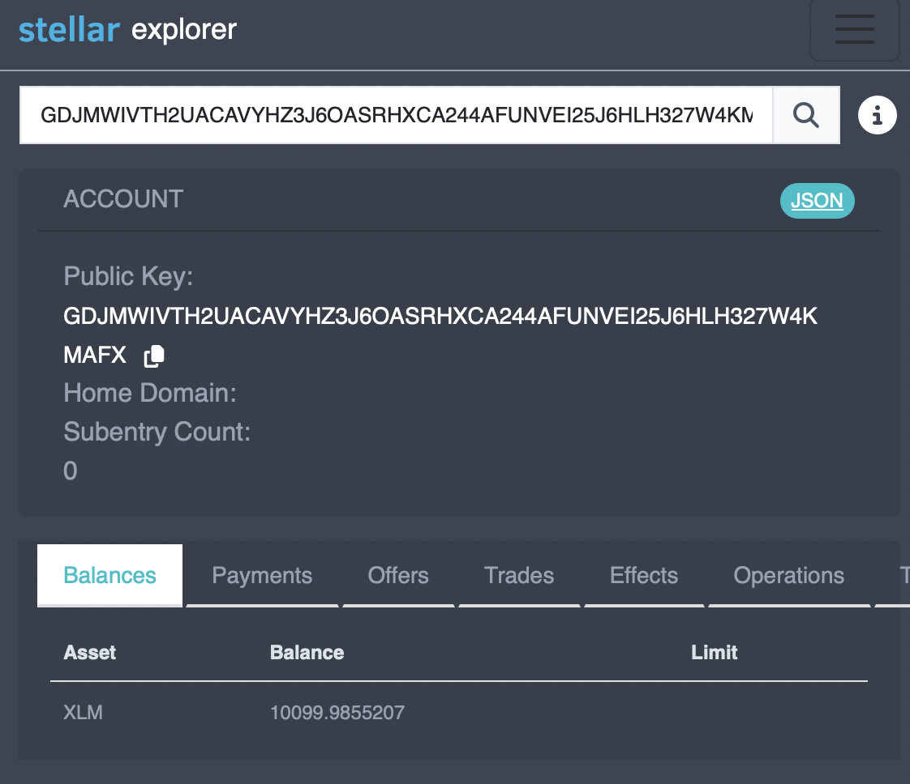

# Pumpit

<table align="center" border="0">
<tr>
<td></td>
<td></td>
</tr>
</table>


The goal of this project is to explore with IOT and
[Soroban](https://soroban.stellar.org) - Stellar Smart Contract.

[Stellar](https://stellar.org) is one of the most used blockchain technology.
It offers concrete real world applications such as ease of cross border
payments, tokenization of real world assets. And in January 2024, things are
getting even better with the ability to write Smart Contracts. In the Stellar
ecosystem, these are called *Soroban contracts*. 

This project demonstrates how the concept of claimable balance can be used to
make a game by using Raspberry Pi(s) which talk to a Soroban contract.
Claimable balance is a powerful concept which allows many real world
applications. Think for instance about a gym with a cycling class. All bikes
could be connected to a contract and based on some scenario, one could win/lose
some gym token. Basically, you can use a contract to incentive any system
using a claimable balance.

## Game Play

It's simple, the Smart Contract is initialised with a volume to *pump* and
multiple addresses each corresponding to a participant. All participants,
have their Raspberry Pi ready to pump, literally, and the first to reach the
pumping level would win and receive the funds.

## Project structure

There are 2 folders:

- *iot*: relates to the client side, Raspberry Pi code.
- *contract*: the Soroban contract itself.

In each folder, there is a handy Makefile with useful commands. Let's go
through the IOT part first, and then we will cover the contract.

## Raspberry Pi

One Raspberry Pi corresponds to one player. A Python service listen on a GPIO
connected to a flow meter (which is attached to a pump). After a given volume
is pumped, a RPC call to the Soroban contract is made to claim funds.

### Hardware

I am using a Raspberry Pi Zero 2 W. BOM:

- Raspberry Pi Zero 2 W
- Water flow meter (+1x 10K and +1x 20K ohm resistances: 5V to 3.3V on the GPIO)
- Button (+1x 220 ohm resistance)
- Green LED (+1x 220 ohm resistance)
- RED LED (+1x 220 ohm resistance)
- RGB LED (+3x 220 ohm resistance)
- A bike pump (and some fitting to attach to the flow meter)

See `iot/pumpit.py` for details on which GPIO to connect, it's very
straightforward:

- The button is to reset the counter/flow history.
- The green LED indicates that we can pump.
- The RGB LED is getting brighter as we pump.
- The red LED blinks when the contract is being invoked.



### Python service

After a classical headless setup of the Raspberry Pi, install everything Python:
```bash
ssh grogu@pumpit -i .ssh/raspberrypi_zero
sudo apt-get install libopenblas-dev
cd iot
python -m venv venv
source venv/bin/activate
pip install .
```

And everything needed to run the Soroban contract:
```bash
# install Rust
curl --proto '=https' --tlsv1.2 -sSf https://sh.rustup.rs | sh
# install Soroban and config
rustup target add wasm32-unknown-unknown
cargo install --locked soroban-cli --features opt
# Hash of the contract and address of the player/claimant
export CONTRACT_HASH_PUMPIT=...
export CLAIMANT_ADDR_PUMPIT=...
```

To run the game client (provided the contract is initialized, see bellow):

```bash
python pumpit.py
```

Behind the scene, it will invoke the contract once we reach the pumping
threshold. Yes this is where you need to get pumping!

## Soroban - Stellar Smart Contract

We define a Smart Contract that hold a claimable balance. When conditions are
met, the balance is transferred to a claimant.

*Note: all commands are listed in a convenient Makefile in the contract folder.*
### Setup
These steps are to be done on any machine, not the Pi(s).

Following the Soroban [doc](https://soroban.stellar.org/docs), we setup a
Soroban local environment and install all dependencies. 
```bash
cd contract
# install Rust
curl --proto '=https' --tlsv1.2 -sSf https://sh.rustup.rs | sh
# install Soroban and config
rustup target add wasm32-unknown-unknown
cargo install --locked soroban-cli --features opt
```

In the following, we will be using *testnet*. Another option for playing
around is to use a docker image to run an actual Stellar network locally.
It's very simple to do as they provide a ready-to-use
[image](https://hub.docker.com/r/stellar/quickstart).

```bash
soroban config network add --global testnet
	--rpc-url https://soroban-testnet.stellar.org:443
	--network-passphrase "Test SDF Network ; September 2015"
```

We create (at least) two accounts on testnet and add some funds (in XLM).
Here I have `mando` and `grogu`. `mando` will be used as the admin of the
contract, and it will also be the one giving up some of its funds to deposit
on the contract.

```bash
# generate addresses
soroban config identity generate grogu
soroban config identity generate mando
# and add funds
soroban config identity fund grogu --network testnet
soroban config identity fund mando --network testnet
mkdir -p .soroban
```

When performing operations on accounts (addresses), we can check an explorer:

https://testnet.steexp.com/account/

Or, to also see contracts and tokens (at the time of writing):

https://stellar.expert/explorer

Let's have a look at our balances. Great, we have some test funds in XLM: 10K.


After our contract is written/tested/ready, we can build and upload it to
*testnet*:

```bash
soroban contract build
soroban contract optimize --wasm target/wasm32-unknown-unknown/release/pumpit.wasm
soroban contract deploy \
	--wasm target/wasm32-unknown-unknown/release/pumpit.optimized.wasm \
	--source mando \
	--network testnet \
	> .soroban/pumpit_id
```

This will build the WASM file, upload it to testnet and create the contract.
The last two operations are distinct transactions on the network, hence there
are 2 fees associated to it (at the time of writing, around 100k stroop.)



Now we can interact with our contract!

### Interact with the contract

We can initialize the admin of the contract (useful to upgrade without
changing the ID/hash on client side):

```bash
soroban contract invoke \
	--source mando \
	--network testnet \
	--id $(shell cat .soroban/pumpit_id) \
	-- \
	init \
	--admin $(shell soroban config identity address mando)
```

Then we can transfer some funds on the contract which will be claimable. Let's
use 100 XLM from our user `mando`. The unit on Soroban is Stroops
which means `100 XLM = 1.10e9 Stroops`. As we are interacting with a contract,
only integers are allowed. We also need a target for our pumping level,
let's say 10L, and we list some addresses which are allowed to claim
the balance. In this case we only want `grogu` to be able to do so:

```bash
soroban contract invoke \
	--source mando \
	--network testnet \
	--id $(shell cat .soroban/pumpit_id) \
	-- \
	deposit \
	--from $(shell soroban config identity address mando) \
	--token $(shell soroban lab token id --asset native --network testnet) \
	--amount 1000000000 \
	--claimants '{ "vec": [{ "address": "$(shell soroban config identity address grogu)" }] }' \
	--pumping_level_target 10
```

Note that to specify the token (XLM), we need to use its hash on the network. 

```bash
soroban lab token id --asset native --network testnet
# CDLZFC3SYJYDZT7K67VZ75HPJVIEUVNIXF47ZG2FB2RMQQVU2HHGCYSC  # may vary
```

Also, `--claimants` is defined in the contract as a vector. The syntax is not
obvious at first, be sure to respect the formatting.

When we execute the command, we can verify the transaction on the explorer.



The contract is ready to be used! The following would be done as part of the
game on the Raspberry Pi(s). For testing purposes, we can try to claim the
contract's balance as if we were `grogu`. We try to claim funds by
e.g. setting the current pumping level to 15L:

```bash
soroban contract invoke \
	--source grogu \
	--network testnet \
	--id $(shell cat .soroban/pumpit_id) \
	-- \
	claim \
	--claimant $(shell soroban config identity address grogu) \
	--pumping_level 15
```

Tada, it should say `in_successful_contract_call: true` and balances of the
contract and claimant have changed as we can verify on-chain:



Checking the balance shows that the address did receive the funds from the
claimable balance:


# What's next!?

This is a simple example, yet it showcase how a simple concept can be used in
a somehow real application. There are a few nice-things we can do to improve
this specific project:

- Make a UI for the Pi(s) so participants can set their address and see their
  progress.
- Use a function to calculate the threshold so that a user cannot by-pass the
  game by calling the contract with a high pumping level without doing anything.
- Synchronize function to ensure multiple players start at the same time, also
  rely on data stored on the contract.

Feel free to raise any issues or even make PRs!
