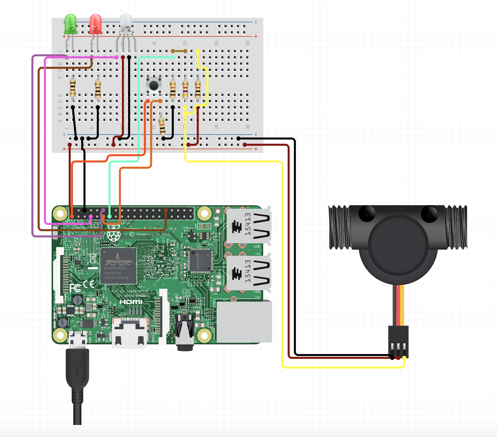

# Pumpit

A random project to play with IOT and Soroban (Stellar Smart Contract).



## Raspberry Pi

### Hardware

I am using a Raspberry Pi Zero 2 W. BOM:

- Raspberry Pi Zero 2 W
- Water flow meter (+1x ... and +1x ... resistances)
- Button (+1x ... resistance)
- Green LED (+1x ... resistance)
- RED LED (+1x ... resistance)
- RGB LED (+3x ... resistance)

### Python service

Install everything:
```bash
sudo apt-get install libopenblas-dev
cd iot
python -m venv venv
source venv/bin/activate
pip install .
```

Then run the service:

```bash
python pumpit.py
```

## Soroban - Stellar Smart Contract

Install Rust:
```bash
curl --proto '=https' --tlsv1.2 -sSf https://sh.rustup.rs | sh
```
